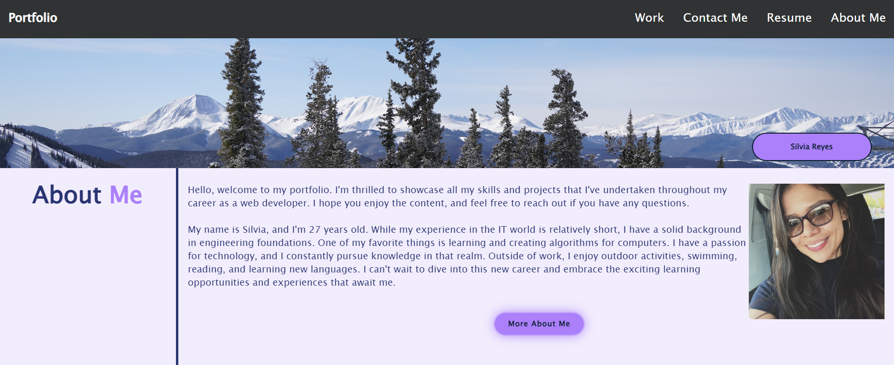

# portfolio
This is the personal portfolio, Challenge #02 

## Description

A personal portfolio website that includes several sections such as a header with a navigation bar, a main section with project images and descriptions, and a contact section.
## Table of Contents

- [Credits](#credits)
- [License](#license)
- [Website-Appearance](#website)

## Credits

N/A

## License

Please refer to the LICENSE in the repo.

## Website

Link to the live application: https://nathaliareyes.github.io/portfolio/
The following image shows the web application's appearance and functionality:

---

## Badges

## Thanks for stopping here!.
